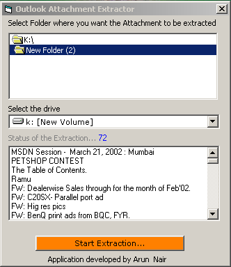



## Attachment Extractor

### Description

A wonderful tool that extracts Attachment Out of any Outlook folders and dumps them into any folder in your hard-disk. I developed this tool out of necessity when I had to find a way to extract image attachment from an ad campaign from more than 1000 mails!! This application has made my life easy and now I can parse through the attachment without opening the mails!!
 
### More Info
 
Attachments in any format they are in

             |
---                |---
**Submitted On**   |2002-04-01 10:09:44
**By**             |[Arun Nair](https://github.com/Planet-Source-Code/PSCIndex/blob/master/ByAuthor/arun-nair.md)
**Level**          |Intermediate
**User Rating**    |4.5 (18 globes from 4 users)
**Compatibility**  |VB 5\.0, VB 6\.0
**Category**       |[Internet/ HTML](https://github.com/Planet-Source-Code/PSCIndex/blob/master/ByCategory/internet-html__1-34.md)
**World**          |[Visual Basic](https://github.com/Planet-Source-Code/PSCIndex/blob/master/ByWorld/visual-basic.md)
**Archive File**   |[Attachment672673312002\.zip](https://github.com/Planet-Source-Code/arun-nair-attachment-extractor__1-33270/archive/master.zip)

